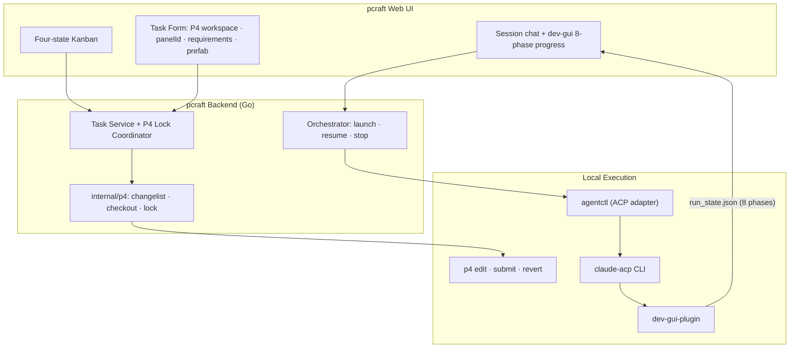

# pcraft

GUI frontend for automated development with **Claude Code + dev-gui-plugin + Perforce (P4)**. Create tasks, track dev-gui pipeline progress, and coordinate P4 file locks — all without leaving the browser.

## What

pcraft is a task management and orchestration GUI designed around a single workflow:

1. Create a task with a **P4 workspace**, panel ID, requirements, and optional prefab path
2. pcraft launches Claude Code with `dev-gui-plugin:run` and monitors the 8-phase pipeline
3. Files are checked out via P4 as Claude writes them; conflicts revert the task to Backlog
4. When the pipeline finishes, you manually submit the P4 changelist; pcraft transitions the task to Closed

One agent (Claude Code via ACP), one VCS (Perforce), one plugin (dev-gui-plugin).

## Task Lifecycle

```
BACKLOG ──(launch)──▶ IN_PROGRESS ──(pipeline done)──▶ DONE ──(p4 submit + confirm)──▶ CLOSED
   ▲                       │
   └──(file conflict)──────┘
```

| State | Meaning |
|-------|---------|
| **Backlog** | Not started, waiting, or reverted due to file conflict |
| **In Progress** | Claude Code running dev-gui-plugin pipeline (8 phases) |
| **Done** | Pipeline complete; pending P4 submit by user |
| **Closed** | Changelist submitted; session terminated; file locks released |

Done sessions stay alive — you can keep chatting with Claude Code before submitting.

## Architecture



## P4 File Lock (Plan A)

agentctl intercepts every `Write`/`Edit` tool call before execution:

```
Claude Write/Edit
  → agentctl PreToolUse
    → POST /tasks/{id}/p4/checkout
      → file available  → p4 edit -c {changelist} → allow
      → file locked by another task → deny → revert → state=BACKLOG
```

Lock state lives in the backend (`task ↔ file ↔ changelist`). agentctl never calls p4 directly.

## dev-gui Plugin Phases

While a task is `IN_PROGRESS`, the UI shows progress across 8 phases:

`gui-plan → gui-draft → gui-prefab → gui-config → gui-review → gui-verify → gui-improve → gui-learn`

Phase state is read from `{P4_ROOT}/.claude/dev-gui-runs/{panelId}/run_state.json`.

## Task Creation Form

| Field | Required | Notes |
|-------|----------|-------|
| Title | yes | |
| P4 Workspace | yes | From registered p4 clients in current workspace |
| Panel ID | yes | Target UI panel for dev-gui-plugin |
| Requirements | yes | Injected into the plugin prompt |
| Prefab path | no | Omitted from prompt when empty |

Prompt injected at launch: `/dev-gui-plugin:run {panelId}, {requirements}[, prefab={path}]`

## Quick Start

### Prerequisites

- Go 1.26+, Node.js 18+, pnpm
- Claude Code CLI (`claude-acp`) in PATH
- dev-gui-plugin at a local path (configure in Settings)
- Perforce CLI (`p4`) in PATH

### From Source

```bash
git clone git@github.com:your-org/pcraft.git
cd pcraft
make bootstrap   # installs toolchain + deps
make dev         # backend :38429, frontend :37429
```

### Environment

Key variables (set in `profiles.yaml` or Settings UI):

```
PCRAFT_*          pcraft-specific config
P4PORT            Perforce server address
P4USER            Perforce username
CLAUDE_PLUGIN_ROOT  path to dev-gui-plugin
```

Per-task variables injected at launch: `P4CLIENT`, `P4CHANGE`, `PCRAFT_TASK_ID`, `PCRAFT_API_URL`.

<details>
<summary><strong>Development</strong></summary>

### Project Structure

```
apps/
├── backend/    # Go backend (orchestrator, agentctl, p4 package, WS gateway)
├── web/        # Next.js frontend (Zustand, real-time subscriptions)
└── packages/   # Shared UI components & types
```

### Commands

```bash
make dev            # start backend + frontend
make dev-backend    # backend only (:38429)
make dev-web        # frontend only (:37429)
make test           # all tests
make lint           # all linters
make typecheck      # TypeScript
make fmt            # format
```

### Key Packages

| Package | Purpose |
|---------|---------|
| `internal/p4/` | P4 client wrapper, changelist management, file lock registry |
| `internal/agentctl/` | ACP adapter, PreToolUse checkout hook |
| `internal/orchestrator/` | Task launch/resume/stop, state transitions |
| `apps/web/components/task-create-dialog*` | Task creation form (P4 workspace + dev-gui fields) |

</details>

## License

[AGPL-3.0](LICENSE)
