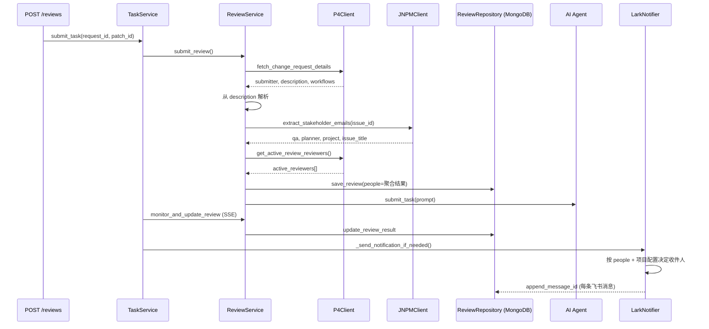
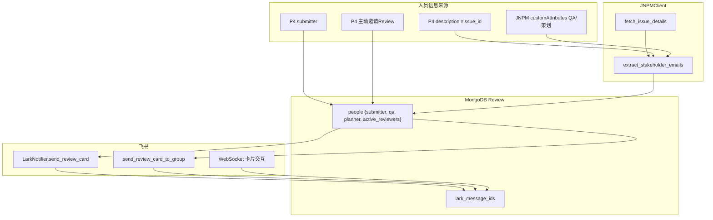

# ai_summarize：JNPM 任务关联与飞书通知机制调研

> 调研对象：`C:\Users\Admin\Documents\GitHub\ai_summarize`  
> 调研时间：2026-07-08  
> 目的：厘清 JNPM 如何把任务与相关人关联，以及飞书机器人如何把审查结果通知到这些人。

---

## 1. 系统概览

`ai_summarize` 是江南工作室内部的 **AI 代码审查 + Bug 分析** 平台，由两个服务协作：

| 服务 | 职责 |
|------|------|
| `src/app` | 对外 API、P4/JNPM 元数据拉取、prompt 构建、任务入队、SSE 监控、MongoDB 落库、**飞书通知**、JNPM/Jenkins 后处理 |
| `src/agent` | 本地 AI 调度、P4 workspace 同步、Claude/Codex CLI 执行 |

**关键结论：** JNPM 不负责「发通知」，它负责提供 **Issue 上下文与干系人邮箱**；飞书模块在审查完成后，根据 MongoDB 中已聚合的 `people` 字段决定收件人并发送卡片。

---

## 2. 端到端数据流



---

## 3. JNPM 模块

### 3.1 代码位置与职责

| 文件 | 职责 |
|------|------|
| `src/app/integrations/jnpm/client.py` | JNPM Open API 封装：Issue 查询、干系人提取、描述回写、AI 报告上传、协作者更新 |
| `src/app/integrations/jnpm/__init__.py` | 导出 `JNPMClient` |

认证方式：`PRIVATE-TOKEN` 请求头（环境变量 `JNPM_PRIVATE_TOKEN`），基址来自 `config/app_config.yaml` 的 `jnpm_base_url`（默认 `https://jn-p-api.bytedance.net/jnpm/`）。

### 3.2 核心 API

| 方法 | HTTP | 用途 |
|------|------|------|
| `fetch_issue_details(issue_id)` | `GET v1/open-api/projects/issues/{id}` | 拉取 Issue 全量详情 |
| `extract_stakeholder_emails(issue_id)` | 内部调用 `fetch_issue_details` | 从 `customAttributes` 解析 QA / 策划 |
| `build_issue_context(issue_id)` | 组合调用 | Bug 分析场景：标题、描述、assignee、qa、planner、附件、图片 URL |
| `update_issue_description` | `PATCH v1/open-api/projects/issues/{id}` | 把 AI 分析结果追加到 Issue 描述 |
| `update_issue_collaborator` | `PATCH` + `customAttributes` | Bug 分析成功后标记 QA 工具为协作者 |
| `upload_ai_test_results` | `POST v1/open-api/issues/{id}/ai-test-results` | 上传 Bug 分析/验证 HTML 报告 |

### 3.3 任务与相关人的关联机制

JNPM **不维护「通知订阅表」**，关联逻辑是 **在任务提交时从多个来源聚合人员信息，写入审查记录的 `people` 字段**。

#### 3.3.1 P4 Review 场景（主路径）

入口：`ReviewService.submit_review()`（`src/app/services/review_service.py`）

**Step 1 — 从 P4 变更描述解析 JNPM Issue ID**

P4 change request 的 `description` 约定以 `#<数字>` 开头，例如 `#755621 修复某某问题`：

```python
# review_service.py
match = re.match(r"#(\d+)", description.strip())
issue_id = int(match.group(1))  # 755621
```

**Step 2 — 从 JNPM Issue 拉取 QA / 策划**

`JNPMClient.extract_stakeholder_emails()` 遍历 Issue 的 `customAttributes`：

| `fullName` | 映射到 | 取值 |
|------------|--------|------|
| `"QA"` | `people.qa` | `values[0].email`, `fullName`/`name` |
| `"策划"` | `people.planner` | 同上 |

同时返回 `issue_title`、`project.name`、`project.fullName`。

**Step 3 — 从 P4Lab 拉取提交者与主动邀请 Reviewer**

| 来源 | 方法 | 写入字段 |
|------|------|----------|
| P4 change request `submitter` | `P4Client.get_submitter_info()` | `people.submitter`（email, name, username） |
| 工作流 `"主动邀请Review"` 的 `defaultReviewers` | `P4Client.get_active_review_reviewers()` | `people.active_reviewers[]` |

**Step 4 — 聚合写入 MongoDB**

```python
people_info = {
    "submitter": {"email", "name", "username"},
    "qa": {"email", "name"},
    "planner": {"email", "name"},
    "active_reviewers": [{"email", "name", "username"}, ...],
}
review_repo.save_review(..., people=people_info, issue_id=..., issue_title=...)
```

**关联链路总结：**

```
P4 description (#issue_id)
    → JNPM Issue customAttributes → QA / 策划
P4 submitter                    → 提交者
P4 workflow "主动邀请Review"     → active_reviewers
    → 全部汇入 review document.people
```

JNPM 在此的角色是 **Issue 维度的干系人目录**；P4 提供 **变更提交者与工作流 Reviewer**。二者在 `people` 结构上并列，而非 JNPM 单方面「拥有」任务。

#### 3.3.2 Bug 分析 / 验证场景

入口：`BugAnalysisService.submit_bug_analysis()`，`task_id` 直接就是 `jnpm_issue_id`（不经 P4 description 解析）。

调用 `jnpm_client.build_issue_context(issue_id)`，内部同样走 `extract_stakeholder_emails()`，得到：

- `assignee`（从 Issue 的 assignee/assignedTo/owner）
- `qa`、`planner`
- `project`、`title`、`description`、附件与图片

结果存入 `issue_context` 字段（`BugAnalysisRepository`），**不经过飞书通知**（Bug 流程无 `_send_notification_if_needed`）。

#### 3.3.3 JNPM 回写（与通知无关，但与 Issue 闭环）

Bug 分析完成后 `_apply_post_actions()`：

1. `update_issue_collaborator` — 设置自定义属性 `ca_5191`（QA 工具协作者 id=2）
2. `upload_ai_test_results` — 上传 `bug_analyse_{id}.html`
3. 可选 `update_issue_ai_analysis` — 把分析摘要追加到 Issue 描述（富文本/HTML）

这些是 **在 JNPM 单据上留痕**，不是飞书推送。

### 3.4 JNPM 项目名与 P4 项目识别

`ReviewService` 用 JNPM `project.fullName` / `project.name` **优先于** P4 解析的项目名（`project_config_service.resolve_project_name()`），保证审查配置（分支、文件过滤、通知配置）与 JNPM 项目一致。

---

## 4. 飞书机器人模块

### 4.1 代码分层

```
integrations/lark/
├── client.py           # 底层 SDK：发消息、更新消息、查用户
├── notifier.py         # 业务卡片：审查卡、错误卡、反馈卡、群发
├── event_handler.py    # WebSocket 卡片按钮/输入回调
├── websocket_service.py # 独立子进程启动 WS 监听
└── __init__.py         # 全局单例 lark_notifier
```

依赖：`lark_oapi`（飞书开放平台 SDK），`APP_ID` / `APP_SECRET` 来自 `.env`。

### 4.2 通知触发时机

| 场景 | 触发函数 | 条件 |
|------|----------|------|
| AI 审查成功 | `processors/task.py::_send_notification_if_needed` | `service_tag` 非 Bug；`result.issues` 中存在 `CRITICAL` 或 `IMPORTANT` |
| 任务失败/重试耗尽 | `_send_error_to_admins` | 发给 `error_recipients` 全员 |
| 用户卡片反馈 | `event_handler._process_input_action` | 异步 `send_feedback_card` → 管理员 |

**Bug 分析/验证不走飞书通知路径。**

### 4.3 收件人决策（核心）

`_send_notification_if_needed()` 从 DB 读取 `review_data.people`：

| 模式 | 收件人 |
|------|--------|
| `DEBUG_MODE` 或请求级 `debug=true` | 仅 `error_recipients`（管理员） |
| 生产模式 | 见下表 |

生产模式发送顺序（邮箱去重，`sent_email_recipients` set）：

| 优先级 | 角色 | 来源字段 | 说明 |
|--------|------|----------|------|
| 1 | 提交者 | `people.submitter.email` | 无邮箱则 fallback 到 `error_recipients` |
| 2 | QA | `people.qa.email` | 来自 JNPM Issue |
| 3 | 主动邀请 Reviewer | `people.active_reviewers[].email` | 来自 P4 工作流 |
| 4 | 项目级额外收件人 | `project_config.notification.recipients` | YAML 配置 |
| 5 | 项目级飞书群 | `project_config.notification.lark_group_id` | `send_review_card_to_group` |

**注意：** `people.planner`（策划）**会展示在卡片上**，但 **不会单独作为收件人** 收到私信；策划信息仅作为模板变量 `planner` 展示。

### 4.4 消息发送实现

**私信（按邮箱）：**

```python
# LarkClient.send_interactive_card
receive_id_type = "email"
msg_type = "interactive"
```

飞书根据企业邮箱把卡片投递到对应用户的机器人会话。

**群消息：**

```python
receive_id_type = "chat_id"
receive_id = lark_group_id  # 如 oc_1054158083d044be58cb5023939960da
```

### 4.5 卡片内容与模板

使用飞书 **消息卡片模板**（非手写 elements 结构为主路径）：

- 模板 ID：`LARK_AI_REVIEW_TEMPLATE_ID`（默认 `AAqd0vmReE7DI`）
- 变量包括：

| 变量 | 含义 |
|------|------|
| `review_url` | P4Lab 变更链接 + `?right={patch_id}` |
| `review_bug_content` | Markdown 格式的问题列表 |
| `request_id` / `patch_id` / `project` | 元数据 |
| `submitter` / `qa` / `planner` | 人员展示（邮箱格式化见下） |
| `issue_id` / `description` | JNPM 关联展示：`#{id} {title}` |
| `note` | 用户反馈追加区（交互后更新） |

`build_lark_issue_display_text()` 优先用 JNPM `issue_title` 生成 `#755621 标题`，避免 P4 description 换行破坏 Markdown。

`_format_contact_display()`：仅保留 `@bytedance.com` 完整邮箱，外部邮箱降级为 `@` 前缀。

### 4.6 多收件人卡片同步

每条成功发送的消息 ID 写入 `lark_message_ids[]`（`ReviewRepository.append_message_id`）。

当任一收件人在卡片上点击「有效/误报/不适用」或提交文字反馈时：

1. `LarkEventHandler` 通过 WebSocket 收到 `card_action_trigger`
2. 更新 MongoDB `feedback` 字段
3. `_update_related_messages()` 用 `PatchMessage` **更新其余收件人的同一张卡片**（跳过当前操作的那条 message_id）

这样多人收到的审查卡 **反馈状态保持一致**。

### 4.7 WebSocket 服务架构

`main.py` lifespan 启动 `ws_service.start()`：

- 独立 **spawn 子进程** `LarkWebSocketWorker`（避免与 FastAPI event loop 冲突）
- 子进程内重新 `mongodb.init_db()` + `ReviewRepository`
- 注册 `P2CardActionTrigger` → `LarkEventHandler.handle_card_action`
- 使用 `lark.ws.Client` 长连接收事件

卡片 action 的 `value` 里携带 `request_id`、`project`、`patch_id`、`note` 等，用于回写 DB 和重建模板变量。

---

## 5. 任务队列如何串起两模块

`TaskService`（`src/app/services/task_service.py`）是统一入口：

1. HTTP API `POST /api/v1/reviews` → `task_service.submit_task()`
2. Worker 线程执行 `processors/task.py::process_task()`
3. `review_service.submit_review()` — **此阶段完成 JNPM 人员关联 + DB 写入**
4. `review_service.monitor_and_update_review()` — SSE 等待 AI
5. 成功后 `_send_notification_if_needed()` — **此阶段读 DB 的 people 发飞书**

JNPM 调用发生在步骤 3；飞书调用发生在步骤 5。中间 AI 执行期间人员信息已固化在 MongoDB，不随 JNPM 实时变更。

---

## 6. 持久化数据结构（审查记录）

`reviews` 集合（`ReviewRepository`）与人员/通知相关字段：

```json
{
  "request_id": "12345",
  "patch_id": "20250708143000",
  "issue_id": "755621",
  "issue_title": "某 Bug 标题",
  "description": "P4 变更描述（已 sanitize）",
  "people": {
    "submitter": { "email": "dev@bytedance.com", "name": "...", "username": "..." },
    "qa": { "email": "qa@bytedance.com", "name": "..." },
    "planner": { "email": "planner@bytedance.com", "name": "..." },
    "active_reviewers": [
      { "email": "reviewer@bytedance.com", "name": "...", "username": "..." }
    ]
  },
  "lark_message_ids": ["om_xxx", "om_yyy"],
  "feedback": {
    "status": "none | valid | invalid | irrelevant",
    "content": "",
    "operator": ""
  },
  "result": { "issues": [...], "review_status": "CRITICAL" }
}
```

---

## 7. 配置清单

| 配置项 | 位置 | 作用 |
|--------|------|------|
| `JNPM_PRIVATE_TOKEN` | `.env` | JNPM API 认证 |
| `jnpm_base_url` | `app_config.yaml` | JNPM 基址 |
| `APP_ID` / `APP_SECRET` | `.env` | 飞书应用 |
| `lark_ai_review_template_id` | `app_config.yaml` | 审查卡片模板 |
| `error_recipients` | `app_config.yaml` | 错误通知 + debug 模式收件人 |
| `projects.<name>.notification` | `app_config.yaml` | 项目级额外收件人 + 群 ID |
| `debug` | `app_config.yaml` | `true` 时所有通知只发管理员 |

Atom 项目示例：

```yaml
notification:
  enabled: true
  lark_group_id: "oc_1054158083d044be58cb5023939960da"
  recipients:
    - "fangwei.951026@bytedance.com"
    - "mufeng@bytedance.com"
```

---

## 8. 设计要点与边界

### 8.1 已做好的设计

1. **关注点分离**：JNPM = Issue 元数据与干系人；P4 = 变更提交者与 Review 工作流；飞书 = 投递与交互。
2. **人员聚合一次写入**：审查过程中不重复调 JNPM，通知阶段只读 DB。
3. **通知门槛**：仅 `CRITICAL`/`IMPORTANT` 才打扰相关人，减少噪音。
4. **多人卡片同步**：`lark_message_ids` + `PatchMessage` 保证反馈一致。
5. **Debug 开关**：开发时不会误发真实提交者。

### 8.2 已知限制

1. Issue ID 依赖 P4 description 格式 `#\d+`，无 Issue 则 QA/策划为空。
2. 策划只展示不通知。
3. Bug 流程无飞书通知（结果回写 JNPM）。
4. 飞书按 **email** 投递，提交者无邮箱时只能 fallback 管理员。
5. `LARK_ROBOT_URL` 在配置中存在，当前代码路径实际走 `lark_oapi` SDK 而非该 HTTP 代理。

---

## 9. 模块关系总图



---

## 10. 关键源码索引

| 主题 | 路径 |
|------|------|
| JNPM 干系人提取 | `ai_summarize/src/app/integrations/jnpm/client.py` → `extract_stakeholder_emails` |
| P4 Review 人员聚合 | `ai_summarize/src/app/services/review_service.py` → `submit_review`（约 L825–L1216） |
| 飞书通知收件人逻辑 | `ai_summarize/src/app/services/processors/task.py` → `_send_notification_if_needed` |
| 飞书卡片发送 | `ai_summarize/src/app/integrations/lark/notifier.py` |
| 卡片交互与多消息同步 | `ai_summarize/src/app/integrations/lark/event_handler.py` |
| WS 子进程 | `ai_summarize/src/app/integrations/lark/websocket_service.py` |
| P4 主动邀请 Reviewer | `ai_summarize/src/app/integrations/p4/client.py` → `get_active_review_reviewers` |
| 项目通知配置 | `ai_summarize/config/app_config.yaml` → `projects.*.notification` |

---

## 11. 若要在 pcraft 复用类似模式

可参考的最小闭环：

1. **任务创建/启动时**从外部系统（类比 JNPM）解析干系人 + 从 VCS/工作流（类比 P4）解析提交者，写入 task metadata 或独立 `people` JSON 列。
2. **任务完成时**按严重级别门槛 + 角色列表决定收件人，不在完成后再调外部 API 查人。
3. 飞书侧使用 **模板卡片 + email 投递**，message_id 列表支持后续 PATCH 同步。
4. 卡片交互走 **独立 WS 进程**，避免阻塞主 API event loop。

这与 pcraft 当前「P4 changelist 任务 + Claude Code」方向不冲突：若未来需要「任务完成通知策划/QA」，可在任务 metadata 中预留 `issue_id` 字段并接入类似 `extract_stakeholder_emails` 的适配层。
