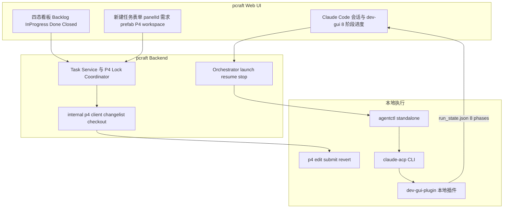
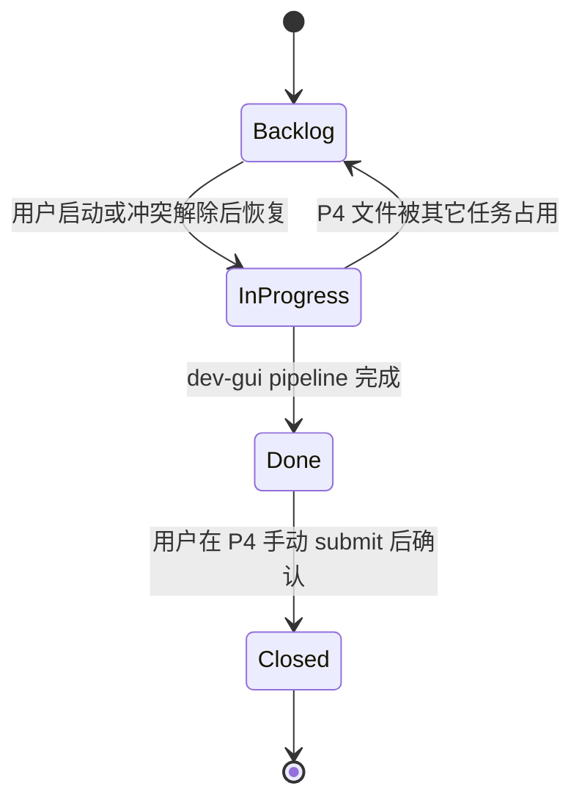
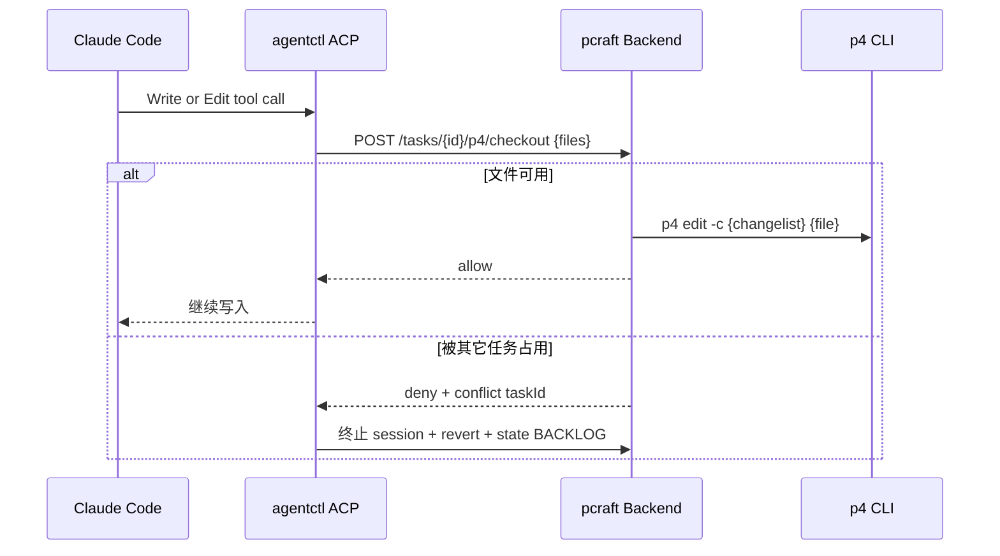
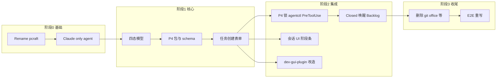

# pcraft 全面改造计划

## 目标架构



**保留：** 任务 CRUD、WebSocket 网关、Orchestrator 启动/恢复/停止、agentctl ACP 适配器（Claude 路径）、standalone executor、完整会话聊天 UI、Zustand store 骨架。

**删除/替换：** 其余 17 个 agent、全部 Git/GitHub/GitLab 栈、worktree、Office、Jira/Linear/Sentry、workflow 模板、Docker/SSH/Sprites executor、CLI 应用、自动化/统计等（详见文末删除清单）。

---

## 已确认决策

| 议题 | 决策 |
|------|------|
| **P4 锁方案** | **方案 A**：agentctl 在 ACP PreToolUse（Write\|Edit）前调用 pcraft checkout API；后端为 lock 唯一真相源 |
| **CANCELLED 状态** | **不保留**；旧数据迁移时映射为 `CLOSED` 或 `BACKLOG`（按是否有未 submit 改动） |
| **Done → Closed** | **pcraft 不自动 `p4 submit`**；用户在 P4 客户端手动 submit；若 submit 遇冲突由用户手动 resolve；完成后在 pcraft 点「我已提交」，后端校验 changelist 已 submitted 再转 `CLOSED` |
| **多 workspace** | **保留** pcraft workspace 切换；每个 workspace 绑定一个或多个 P4 client（可能对应不同 stream/分支）；任务创建时只能选当前 workspace 下的 P4 client |
| **dev-gui-plugin** | **与 pcraft 并行改造**（非可选协调项），见 [阶段 7](#阶段-7dev-gui-plugin-并行改造) |
| **Backlog 唤醒** | **自动**：Closed 释放文件后，pcraft 自动 `LaunchSession`（resume prompt），无需用户手动点启动 |
| **Done 时会话** | **保留会话**：用户可继续向 Claude Code 提问；**仅 `CLOSED` 才完全终止会话** |
| **同 client 并行** | **允许**：同一 P4 client 上可并行多个 `IN_PROGRESS` 任务（各用独立 changelist，靠方案 A 文件锁互斥） |

---

## 阶段 0：重命名与基线裁剪（可并行）

### 0.1 项目重命名 `kandev` → `pcraft`

| 范围 | 关键路径 | 动作 |
|------|----------|------|
| Go module | [`apps/backend/go.mod`](apps/backend/go.mod) | `github.com/kandev/kandev` → `github.com/.../pcraft`（按你的 GitHub org 定） |
| npm 包 | [`apps/web/package.json`](apps/web/package.json) 等 | `@kandev/web` → `@pcraft/web` |
| 环境变量 | [`profiles.yaml`](profiles.yaml) | `KANDEV_*` → `PCRAFT_*`（可保留 alias 一层过渡） |
| 数据目录 | 全局 | `~/.kandev` → `~/.pcraft` |
| 二进制 | [`apps/backend/cmd/kandev/`](apps/backend/cmd/kandev/) | 重命名为 `cmd/pcraft/` |
| 文档 | [`AGENTS.md`](AGENTS.md) | 重写为 pcraft 架构说明 |

> 建议：**先完成 rename + wiring 编译通过**，再删大块功能，避免 import 大面积断裂难以定位。

### 0.2 仅保留 Claude Code agent

**保留文件：**
- [`apps/backend/internal/agent/agents/claude_acp.go`](apps/backend/internal/agent/agents/claude_acp.go)
- [`apps/backend/internal/agent/agents/mock.go`](apps/backend/internal/agent/agents/mock.go)（dev/e2e 用，可 alias 为 `claude-acp`）
- ACP adapter 通用层 + [`enricher_claude.go`](apps/backend/internal/agentctl/server/adapter/transport/acp/enricher_claude.go)

**修改：**
- [`registry/registry.go`](apps/backend/internal/agent/registry/registry.go) — `LoadDefaults()` 仅注册 Claude + Mock
- [`canonical_routing_providers.go`](apps/backend/internal/agent/registry/canonical_routing_providers.go) — 仅 `"claude-acp"`
- 删除前端 agent 选择 UI：任务创建不再展示 profile 下拉，**硬编码 claude-acp default profile**

**删除：** `agents/` 下其余 ~17 个 agent 实现、对应 logos、enricher_codex/opencode/cursor、非 Claude MCP strategies。

---

## 阶段 1：任务状态模型（四态）

### 1.1 新状态枚举

在 [`apps/backend/pkg/api/v1/task.go`](apps/backend/pkg/api/v1/task.go) 与 [`apps/web/lib/types/http.ts`](apps/web/lib/types/http.ts) 定义：

| 状态 | DB 值 | 语义 |
|------|-------|------|
| Backlog | `BACKLOG` | 未开始（无 prompt / 等待启动 / 文件冲突回退） |
| In Progress | `IN_PROGRESS` | Claude Code 正在执行 dev-gui pipeline |
| Done | `DONE` | pipeline 完成，等待 P4 手动 submit；**会话保留**，用户仍可继续提问 |
| Closed | `CLOSED` | 用户已在 P4 submit 并确认；**会话完全终止**，释放文件锁 |

**仅保留以上四态，删除 `CANCELLED` 及全部旧 Kanban/Office 状态。**

**旧数据迁移映射：**
- `CREATED/TODO/SCHEDULING/CANCELLED → BACKLOG`（`CANCELLED` 无未 submit 改动时）或 `CLOSED`（已有 submit 记录时）
- `REVIEW/WAITING_FOR_INPUT/BLOCKED/FAILED → IN_PROGRESS` 或 `BACKLOG`（文件冲突回退）
- `COMPLETED → DONE`

### 1.2 状态转换规则



**关键改动点：**
- [`orchestrator/task_operations.go`](apps/backend/internal/orchestrator/task_operations.go) — 启动/完成/失败时的 state 更新
- [`orchestrator/event_handlers_workflow.go`](apps/backend/internal/orchestrator/event_handlers_workflow.go) — 去掉 workflow step 驱动 state（workflow 整包删除后此处大幅简化）
- 前端看板：重写 [`apps/web/lib/ui/state-labels.ts`](apps/web/lib/ui/state-labels.ts)，四列 Kanban 替代现有 10 态 + workflow 列
- **删除** Office 状态映射层（[`normalize-status.ts`](apps/web/app/office/tasks/normalize-status.ts) 等，随 Office 删除）

### 1.3 dev-gui 执行阶段（In Progress 子状态）

dev-gui-plugin 已有 8 阶段状态机（[`dev-gui-plugin/tools/gui_run_state.py`](C:/Users/Admin/Documents/GitHub/dev-gui-plugin/tools/gui_run_state.py)）：

`gui-plan → gui-draft → gui-prefab → gui-config → gui-review → gui-verify → gui-improve → gui-learn`

**pcraft 侧实现：**
- 任务 metadata 或新表字段 `gui_phase` + `gui_phase_status`
- 后端定时/WS 订阅读取 `{P4_WORKSPACE}/.claude/dev-gui-runs/{panelId}/run_state.json`
- 前端 In Progress 任务卡片/详情页展示阶段进度条（替代现有 workflow stepper / [`stage-progress-bar.tsx`](apps/web/components/task/simple/stage-progress-bar.tsx) 的 Office 逻辑）

---

## 阶段 2：P4 集成（核心新增）

### 2.1 数据模型

**pcraft workspace（保留）+ P4 client 绑定：**

用户可在 UI 顶栏切换 **pcraft workspace**；每个 workspace 代表一个独立项目上下文，可对应不同的 P4 stream/分支。同一用户可配置多个 workspace，每个 workspace 下注册若干 **P4 client**（本地 workspace view）。

**`p4_workspaces` 表（替代 git `repositories`）：**

| 字段 | 说明 |
|------|------|
| `id`, `workspace_id` | 关联 pcraft workspace（FK） |
| `name` | 显示名 |
| `p4port`, `p4user` | P4 连接（可继承 workspace 或全局默认） |
| `p4client` | P4 client name |
| `p4stream` | Stream 路径（`//depot/main` 等，从 `p4 client -o` 解析） |
| `root_path` | client root 本地路径 |
| `is_default` | 该 pcraft workspace 下的默认 P4 client |

**Workspace 切换行为：**
- 切换 pcraft workspace → Kanban/任务列表/filter 仅显示该 workspace 下任务
- 新建任务 → P4 client 下拉仅列出**当前 workspace** 已注册的 clients（通过 `p4 clients` 发现 + 用户导入/绑定）
- 不同 workspace 的 P4 client 可指向不同 stream（分支），任务与 client 绑定后不可跨 workspace 迁移

**任务级 P4 字段（`tasks` 或 `task_environments`）：**
- `p4_workspace_id` — 创建时选择的 P4 workspace
- `p4_changelist` — 专属 pending changelist number
- `p4_checked_out_files` — JSON 数组，本任务已 checkout 的文件
- `blocked_by_task_id` — 若因冲突回退 Backlog，记录占用方

**删除/废弃表：** `task_session_worktrees`, `task_session_git_snapshots`, `task_session_commits`, `task_repositories` 的 branch 字段；GitHub/GitLab 全部表。

### 2.2 新建 `internal/p4/` 包

参考 [`internal/jira/`](apps/backend/internal/jira/) 的 Provide 模式：

```
internal/p4/
├── client.go      # 封装 p4 命令：clients, change, edit, revert, opened, submit
├── workspace.go   # 列举本地 p4 clients（p4 clients -u $USER）
├── changelist.go  # 每任务 create/close changelist
├── lock.go        # task↔file 映射 + 冲突检测
├── handlers.go    # REST: GET /p4/workspaces, POST /p4/checkout
├── mock_client.go # e2e
└── provider.go
```

### 2.3 P4 workspace 发现与任务创建

**重写任务创建表单**（基于 [`task-create-dialog.tsx`](apps/web/components/task-create-dialog.tsx)）：

| 字段 | 必填 | 映射 |
|------|------|------|
| 任务名 | 是 | `title` |
| P4 Workspace | 是 | `p4_workspace_id`（下拉，仅本地 `p4 clients`） |
| panelId | 是 | metadata |
| 需求描述 | 是 | metadata |
| prefab 路径 | 否 | metadata |

**删除：** `RepositorySelector`、`BranchSelector`、GitHub URL 模式、remote repo、agent profile 选择、workflow 选择、fresh-branch consent 流。

**Prompt 拼接（启动时注入）：**
```
/dev-gui-plugin:run {panelId}, {需求描述}, prefab={prefab路径}
```
prefab 为空时省略 `prefab=` 段。

**Backlog 两种场景：**
1. 创建后仅保存表单，不 launch → 状态 `BACKLOG`，无 session
2. 运行中文件冲突 → orchestrator 终止 agent，revert 本任务未 submit 的 edit，状态 → `BACKLOG`，metadata 记录 `blocked_reason`

### 2.4 文件 checkout / 冲突 — 方案 A（已选定）

**实现路径：agentctl PreToolUse 拦截**



**agentctl 改动（[`apps/backend/internal/agentctl/`](apps/backend/internal/agentctl/)）：**
- 在 ACP adapter 的 permission/PreToolUse 路径（或新增 hook 注册点）拦截 `Write`/`Edit`
- 从 session context 读取 `task_id`、`p4_changelist`
- 调用 pcraft backend `POST /api/v1/tasks/{id}/p4/checkout`（非经 agentctl 自调 p4，lock 逻辑集中在 backend）
- deny 时返回 permissionDecisionReason，并 WS 通知 backend 触发冲突回退

**backend `internal/p4/lock.go`：**
- 维护 `task_id ↔ file_path ↔ changelist` 映射（SQLite）
- checkout 前查 lock 表 + `p4 opened` 交叉验证
- 冲突时：orchestrator `StopTask` → `p4 revert -c {cl}` → `state=BACKLOG` → `blocked_by_task_id`

**冲突处理流程：**
1. Task A 正在 In Progress，Task B 的 agent 尝试 Write 同一文件
2. agentctl PreToolUse → pcraft checkout API 检测冲突
3. 终止 Task B session，`p4 revert -c {changelist}` → 状态 `BACKLOG`
4. 记录 `blocked_by_task_id = A`，`blocked_reason = file_conflict`

### 2.5 Done → Closed 与 Closed 唤醒 Backlog

**Done 阶段（pipeline 完成，等待 submit）：**
- dev-gui-plugin 跑完 8 阶段（或 pcraft 检测到 `run_state.json` 全部 terminal）→ 任务 `IN_PROGRESS → DONE`
- **保留 Claude Code 会话**：用户可继续提问、查看历史；不自动 submit
- 若 Done 状态下用户再次 Write/Edit 文件，仍走方案 A checkout（同一 changelist）；是否允许改代码需产品约束（默认可 edit，仍属同一 pending changelist）
- P4 Changes 面板显示：changelist #、pending files、操作指引「请在 P4 客户端手动 submit changelist #{n}」
- **pcraft 不执行 `p4 submit`**；submit 冲突由用户在 P4 客户端手动 resolve

**Closed 阶段（用户确认 submit 完成 — 唯一终止会话时机）：**
1. 用户点击「我已提交」
2. pcraft 校验 changelist 已 submitted
3. 校验失败 → 保持 `DONE`，会话继续可用
4. 校验成功 → `DONE → CLOSED`，**终止 session**，释放 lock registry
5. 发布 `p4.files_released` 事件

**Closed → 自动唤醒 Backlog：**
6. 遍历同 pcraft workspace 下符合条件的 `BACKLOG` 任务
7. 检查所需文件是否可 checkout
8. **自动** `LaunchSession`（resume prompt），无需用户手动点启动

### 2.6 dev-gui-plugin 状态恢复（概要，详见阶段 7）

Backlog → In Progress 自动恢复时，prompt 使用 resume 模式；具体改动在 dev-gui-plugin 仓与 pcraft 并行实施。

### 2.7 替换 Git UI → P4 Changes 面板

**删除：** [`changes-panel`](apps/web/components/task/changes-panel.tsx) 全族、git status WS handler、PR 对话框

**新建：** P4 Changes 面板
- 显示当前任务 changelist #、pending files（`p4 opened -c {cl}`）
- **Done 状态：** 提示用户在 P4 客户端手动 submit；不展示 submit 按钮（pcraft 不代 submit）
- **Closed 操作：** 「我已提交」→ 校验 changelist 已 submitted → `CLOSED` → 终止 session
- submit 冲突时：面板显示 changelist 仍为 pending，引导用户去 P4 resolve 后重试确认

agentctl 层：删除 [`api/git.go`](apps/backend/internal/agentctl/server/api/git.go) 等，新增 `api/p4.go`（或 backend 直接调 p4，不经 agentctl——**推荐 backend 直调**，因 lock 协调在 backend）。

---

## 阶段 3：执行环境简化

### 3.1 Executor

**仅保留：** [`executor_standalone.go`](apps/backend/internal/agent/runtime/lifecycle/executor_standalone.go)（Windows 本地 Claude Code）

**删除：**
- Docker / SSH / Sprites / remote executors
- [`apps/web/app/settings/executors/`](apps/web/app/settings/executors/) 复杂 CRUD → 简化为「Claude Code 路径 + dev-gui-plugin 路径」设置页

### 3.2 Claude Code + dev-gui-plugin 配置

设置页新增：
- Claude Code CLI 路径（默认 PATH）
- dev-gui-plugin 路径：`C:\Users\Admin\Documents\GitHub\dev-gui-plugin`
- P4：`P4PORT`, `P4USER`, `P4CLIENT` 默认值

Lifecycle 启动时注入环境变量：`CLAUDE_PLUGIN_ROOT`, `P4CLIENT`（任务 workspace 的 client）, `P4CHANGE`（任务 changelist）。

---

## 阶段 4：UI 保留与裁剪

按你的选择 **保留完整会话 UI**，删除 Git/PR 相关面板：

| 保留 | 删除 |
|------|------|
| 聊天消息流、工具卡片、subagent 卡片 | changes/git diff 面板 |
| Terminal（可选保留，调试用） | GitHub PR 面板、Create PR |
| dev-gui 8 阶段进度条（新建） | workflow stepper/switcher |
| 四态 Kanban | Office 全部路由 |
| 任务创建对话框（重写表单） | repository/branch 选择器 |
| Browser preview（如 GUI 预览需要可保留） | stats、automations、integrations 设置 |

**路由精简：** 删除 [`apps/web/app/office/`](apps/web/app/office/)、[`apps/web/app/github/`](apps/web/app/github/)、integrations 页；主入口为 Kanban + Task Detail。

**多 workspace UI（保留并改造）：**
- 保留 [`app-sidebar-workspace-picker.tsx`](apps/web/components/app-sidebar-workspace-picker.tsx) 等 workspace 切换组件
- 设置页 [`settings/workspace/`](apps/web/app/settings/workspace/) 改为 **P4 client 注册/绑定**（替代 git repository CRUD）
- 每个 pcraft workspace 可绑定多个 P4 client（不同 stream/分支），显示 stream 路径便于区分

---

## 阶段 5：大块功能删除清单

### A. 整包删除（~300+ 文件）

| 目录 | 理由 |
|------|------|
| [`apps/backend/internal/office/`](apps/backend/internal/office/) | 自治 agent 体系 |
| [`apps/backend/internal/github/`](apps/backend/internal/github/) | GitHub 集成 |
| [`apps/backend/internal/gitlab/`](apps/backend/internal/gitlab/) | GitLab 集成 |
| [`apps/backend/internal/jira/`](apps/backend/internal/jira/) | Jira |
| [`apps/backend/internal/linear/`](apps/backend/internal/linear/) | Linear |
| [`apps/backend/internal/sentry/`](apps/backend/internal/sentry/) | Sentry |
| [`apps/backend/internal/worktree/`](apps/backend/internal/worktree/) | Git worktree |
| [`apps/backend/internal/repoclone/`](apps/backend/internal/repoclone/) | Git clone |
| [`apps/backend/internal/automation/`](apps/backend/internal/automation/) | 自动化 |
| [`apps/backend/internal/workflow/`](apps/backend/internal/workflow/) | Workflow 引擎 |
| [`apps/cli/`](apps/cli/) | CLI 应用 |
| [`apps/web/app/office/`](apps/web/app/office/) | Office UI |
| [`apps/web/components/github/`](apps/web/components/github/) | GitHub UI |
| [`apps/web/e2e/tests/office/`](apps/web/e2e/tests/office/) | Office E2E |

### B. 大幅修改（非删除）

| 文件 | 改动 |
|------|------|
| [`apps/backend/internal/backendapp/services.go`](apps/backend/internal/backendapp/services.go) | 移除 Office/GitHub/Jira/Linear 等 init；加入 `initP4Service` |
| [`apps/backend/internal/task/service/service_tasks.go`](apps/backend/internal/task/service/service_tasks.go) | 创建任务：P4 changelist + 新表单字段 |
| [`apps/backend/internal/task/repository/sqlite/base_schema.go`](apps/backend/internal/task/repository/sqlite/base_schema.go) | P4 表 + 四态 migration |
| [`apps/web/components/task-create-dialog*.tsx`](apps/web/components/task-create-dialog.tsx) | 重写表单 |
| [`apps/backend/internal/orchestrator/`](apps/backend/internal/orchestrator/) | 去掉 watcher sources、workflow callbacks |

### C. 建议保留

| 组件 | 理由 |
|------|------|
| `mock-agent` | dev/e2e 不消耗真实 Claude token |
| WebSocket 网关 | 实时 UI |
| agentctl ACP adapter | Claude Code 通信 |
| `@kandev/ui` → `@pcraft/ui` | shadcn 组件库 |

---

## 阶段 6：测试与文档

1. **Spec：** 新建 `docs/specs/pcraft/` — P4 任务模型、四态流转、方案 A 锁、手动 submit 流程、Closed 唤醒
2. **Backend 测试：** `internal/p4/*_test.go` — changelist、checkout 冲突、submit 校验、lock release
3. **agentctl 测试：** PreToolUse checkout allow/deny 路径
4. **Frontend 测试：** 任务创建表单、四态 Kanban、P4 Changes 面板、workspace 切换
5. **E2E：** 核心流 — 创建 Backlog → 启动 → pipeline Done → 手动 submit mock → Closed → Backlog 恢复
6. **dev-gui-plugin 测试：** resume 参数、pipeline 完成回调（见阶段 7）

---

## 阶段 7：dev-gui-plugin 并行改造

仓库：[`C:/Users/Admin/Documents/GitHub/dev-gui-plugin`](C:/Users/Admin/Documents/GitHub/dev-gui-plugin)（与 pcraft 同步 PR/发版）

### 7.1 `/dev-gui-plugin:run` 支持 resume

**改动 [`commands/run.md`](C:/Users/Admin/Documents/GitHub/dev-gui-plugin/commands/run.md)：**
- 解析参数 `resume=true`（或检测已有 `run_state.json` 自动 resume）
- resume 模式：调用 `gui_run_state.py resume` 获取目标 phase，从该 phase 继续而非从 gui-plan 重跑
- 保留 autorun 哨兵逻辑，session_id 绑定不变

### 7.2 pcraft task 绑定

**启动时写入 run metadata（新文件或在 `run_state.json` 扩展字段）：**
- `pcraft_task_id` — pcraft 注入（通过 prompt 前缀或环境变量 `PCRAFT_TASK_ID`）
- `p4_changelist` — 便于插件侧只读展示（checkout 仍走 pcraft 方案 A，不在插件重复实现）

Lifecycle 启动 agent 时注入：`PCRAFT_TASK_ID`, `PCRAFT_API_URL`, `P4CHANGE`, `P4CLIENT`

### 7.3 pipeline 完成 → 通知 pcraft 转 Done

**改动 [`commands/run.md`](C:/Users/Admin/Documents/GitHub/dev-gui-plugin/commands/run.md) 收尾步骤 + 可选新 hook：**
- 8 阶段全部 terminal 后，调用 pcraft API：`PATCH /api/v1/tasks/{id}` `{state: "DONE"}` 
- 或新增 lightweight 脚本 `tools/pcraft_notify.py`（HTTP POST，失败 open 不阻塞插件收尾）
- 移除 `.autorun.json` 哨兵（现有逻辑保留）

### 7.4 Backlog 冲突暂停与恢复配合

- 冲突回退由 **pcraft/agentctl 方案 A** 处理（StopTask + revert），插件无需 PreToolUse checkout
- resume 被 pcraft 唤醒时：pcraft 发 `/dev-gui-plugin:run ..., resume=true`；插件从 `gui_run_state.py resume` 断点继续
- 若 run 目录已有部分 phase 为 `done`，resume 不重跑已完成阶段（现有 `resume_point` 语义）

### 7.5 可选：pipeline 阶段 WS 推送

- 每 phase `set ... done` 时，可选调用 pcraft `PATCH .../gui-phase` 更新 UI 进度条（减少轮询 `run_state.json`）
- 首版可仅 pcraft 后端轮询文件，插件改动最小化；阶段推送作为优化项

### dev-gui-plugin 改动文件清单

| 文件 | 改动 |
|------|------|
| `commands/run.md` | resume 参数、pcraft task 绑定、完成时 notify Done |
| `tools/gui_run_state.py` | 可选扩展 `pcraft_task_id` 字段 |
| `tools/pcraft_notify.py` | **新建** — 调 pcraft API（done / phase update） |
| `hooks-handlers/on_stop_continue.py` | 无需改 checkout；确认 conflict-stop 后 autorun 不误驱动 |
| `.claude-plugin/plugin.json` | 版本 bump，声明 pcraft 集成 |

---

## 建议实施顺序



**原则：** 先 **rename + Claude-only + 四态** 编译通过 → 再 **P4 核心 + dev-gui-plugin 并行** → 最后 **大块删除**（避免同时改 import 和删包）。
